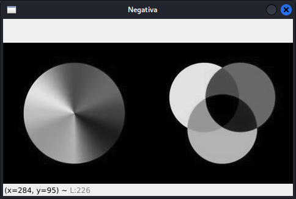
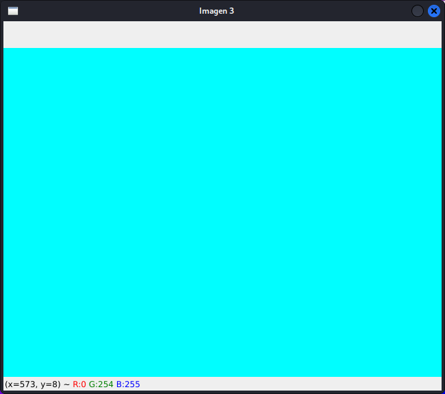
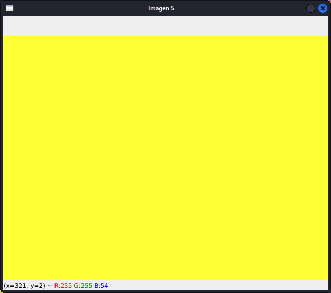

# Visión Robótica

=
## Actividad 1

En esta actividad se observa como funciona el modelo
***RGB*** y la escala de grises en una imagen
digital.

Algunas imágenes de ejemplo son las siguientes.

    
    
    
    

Las primeras 2 son imágenes en escala de grises, mientras que las
últimas 2 usan el modelo ***RGB***.

=
## Actividad 2

La imagen usada para esta actividad es

    

En la actividad 2 se usan filtros ***RGB*** como este

    

o este

    

En estos filtros se extre o elimina alguno de los canales ***RGB*** de la imagen,
así, se obtienen filtros como los anteriores.

En esta actividad también se usan filtros para convertir las imagenes a escala de
grises. Se usaron 3, por escala de grises por promedio, y las ponderaciones
*BT.601* y *BT.709*.

En la siguiente imagen se muestran las 3 formas usadas para convertir una imagen
a escala de grises, además usando también el método ***RGB*** anterior.

    
    
    

La primer imagen es la original, en la segunda se muestra el método ***RGB*** y
en la tercera son los métodos por promedio, *BT.601* y *BT.709*.

=
## Actividad 3

En la actividad 3 se ve la manera de obtener la versión negativa de una imagen
y funciones de **open** para poder rotar una imagen.

    
    
    

=
## Actividad 4

En la actividad 4 se crean y observan histogramas de imágenes con **numpy** y
**matplotlib**.

    
    

=
## Actividad 5

En esta actividad se ecualizan las imágenes y se observan sus histogramas, para
ver el cambio que tienen al manipular sus valores.

### Imagen original

    

### Imagen con cambios iguales en los canales *RGB*

    

### Imagen ecualizada

    

### Histogramas de la imagen

    
    

=
## Actividad 6

En la actividad 6 se hacen pruebas con el modelo ***HSV***.

### Prueba con el parámetro *'Hue'*

    
    
    

### Prueba con el parámetro *'Saturation'*

    
    
    

### Prueba con el parámetro *'Value'*

    
    
    

=
## Actividad 7

En esta actividad se aplican máscaras a imágenes para detectar un color usando
el espacio de color *HSV*.

### Imagen 1

    
    

### Imagen 2

    
    

### Imagen 3

    
    

En este caso, se buscaba aplicar la máscara para el color verde.

=
## Actividad 8

En la actividad 8 se continúa con lo que se hizo en la actividad 7, pero aquí se
busca obtener el objeto o sujeto que se encuentra cubierto por el color deseado.

    
    
    
    

Primero se obtiene la máscara, después la negativa de esta, y por último, se
cambian los pixeles que se encuentran en blanco por la los pixeles de la imagen
original.

=
## Actividad 9

Luego de lo realizado en la actividad 8, en esta actividad se cambia el fondo de
la imagen.

### Imágenes originales

    
    

### Imágenes obtenidas

    
    
    

La idea es similar a la actividad anterior, esta vez se sustituyen los pixeles
del color por los pixeles del fondo que se quiere y al final se mezclan las
imágenes con el objeto y el fondo.

=
## Actividad 10

En esta actividad se hace lo mismo que con las actividades 7 y 8, pero esta vez
aplicadas a un video.

    

=
## Actividad 11

En la actividad 11 se hace lo mismo que con la actividad 9, pero esta vez
aplicado a un video.

    

=
## Actividad 12

En esta actividad se usa un algoritmo para rellenar espacios que quedaron al
segmentar el color de una imagen, esto para rellenar las figuras y después poder
hacer un etiquetado de objetos.

### Imagen original

    

### Imágenes obtenidas con el algoritmo

    
    
    
    

Para este algoritmo primero se hace la segmentación del color, luego se obtienen
los pixeles que se van a rellenar, después se crea la imagen negativa y se
agrega a la máscara del inicio.

## Actividad 13

En la actividad 13 se usa el algoritmo para rellenar pixeles para poder
etiquetar objetos de color de mejor manera.

### Imagen original

    

### Imagen original

    
    
    

Primero se muestra la imagen con el algoritmo de rellenado aplicado, después se
muestra la imagen con el objeto al que le corresponde la etiqueta 1 y después el
de la etiqueta 2.

=
## Actividad 14

En esta actividad se detectan contornos de objetos sementados

    
    

=
## Actividad 15

En la actividad 15 se aplican filtros a la imagen usando ***kernels***.

Usando el ***kernel***

$$
k =
\begin{bmatrix}
    1 & 1 & 1 & 1 & 1 & 1 & 1 \\
    1 & 1 & 1 & 1 & 1 & 1 & 1 \\
    1 & 1 & 1 & 1 & 1 & 1 & 1 \\
    1 & 1 & 1 & 1 & 1 & 1 & 1 \\
    1 & 1 & 1 & 1 & 1 & 1 & 1 \\
    1 & 1 & 1 & 1 & 1 & 1 & 1 \\
    1 & 1 & 1 & 1 & 1 & 1 & 1
\end{bmatrix} \dfrac{1}{49}
$$

se tiene la imagen de la derecha

    
    

=
## Actividad 16

En esta actividad se usa el ***Filtro de Harris***, que sirve para detectar
esquinas en la imagen.

    

=
## Actividad 17

En esta actividad se usa el ***Filtro de Canny***, que sirve para detectar
bordes en la imagen.

    

=
## Actividad 18

En esta actividad se usan operaciones morfológicas a la imagen.

- Erosión
- Dilatación
- Opening
- Closing

### Imagen original

    

### Imágenes obtenidas

    
    

La primer imagen tiene una operación de erosión, mientras que la segunda tiene
una operación de dilatación.

=
## Actividad 19

En la actividad 19 se usa la ***Transformada Hough***, que también sirve para
detectar bordes de una imagen.

    
    
    

    
    
    

=
## Proyecto 1

En el proyecto 1 se obtuvo el histograma de 3 imágenes y con este, su
exposición, si se tiene una imagen sub o sobre-expuesta la imagen se ecualiza
y se muestra en la imagen un mensaje, si no, solo se muestra un mensaje en la
imagen.

### Imagen sub-expuesta

    
    
    

### Imagen sobre-expuesta

    
    
    

### Imagen con buena exposición

    
    

=
## Proyecto 2

En el proyecto 2 se realizó la segmentación del color, pero desde un video
tomado desde la web cam de la computadora, en el video se muestra el contorno de
un objeto de color detectado.

    

=
## Proyecto 3

En este proyecto se hizo una cámara que pueda seguir un objeto de color, esto
gracias a una conexión serial con un ***Arduino*** y dos servomotores.

## Imágenes del prototipo

    
    

### Resultados obtenidos

    
    
    

